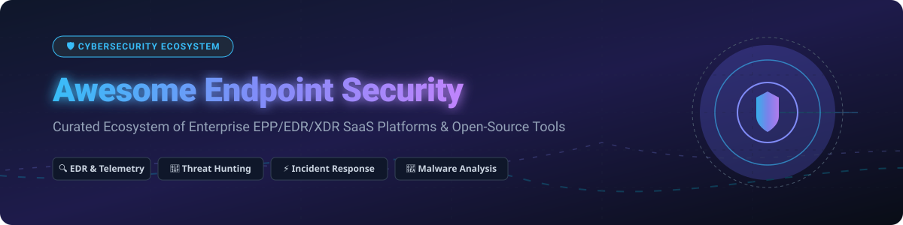

# 🛡️ Awesome Endpoint Security Ecosystem



<p align="center">
  <a href="https://github.com/ishandutta2007/Awesome-Awesome-Awesome"></a><a href="https://discord.gg/jc4xtF58Ve"></a>
  <a href="https://github.com/ishandutta2007/Awesome-Endpoint-Security"></a>
  <a href="https://github.com/ishandutta2007/Awesome-Endpoint-Security/blob/main/LICENSE"></a>
  <a href="https://github.com/ishandutta2007"></a>
</p>

> **A curated, battle-tested list of enterprise Endpoint Security SaaS products & open-source GitHub projects for Endpoint Protection (EPP), Endpoint Detection & Response (EDR), Extended Detection & Response (XDR), Threat Hunting, Malware Analysis, and Incident Response (IR).**

---

## 📑 Table of Contents

- [📊 Sector & Market Overview](#-sector--market-overview)
- [☁️ SaaS & Enterprise Endpoint Security Platforms](#️-saas--enterprise-endpoint-security-platforms)
- [🔓 Open-Source Endpoint Security & Telemetry Projects](#-open-source-endpoint-security--telemetry-projects)
- [🧱 Modular Self-Hosted EDR/XDR Architecture](#-modular-self-hosted-edrxdr-architecture)
- [🤝 How to Contribute](#-how-to-contribute)
- [💖 Support & Community](#-support--community)
- [📈 Star History](#-star-history)
- [📜 Disclaimer](#-disclaimer)

---

## 📊 Sector & Market Overview

The global **Endpoint Security Sector** is estimated at **$15.2 Billion in 2026** (projected to reach **$26.8 Billion by 2030** at a CAGR of ~11.8%). The market is **moderately fragmented**, with dominant market share consolidated among top cybersecurity giants (Microsoft, CrowdStrike, SentinelOne, Palo Alto Networks) while maintaining a rich ecosystem of specialized EDR/XDR vendors and open-source telemetry frameworks.

---

## ☁️ SaaS & Enterprise Endpoint Security Platforms

Top enterprise Endpoint Protection Platforms (EPP), EDR, and XDR cloud solutions ranked by company market size (Revenue / Market Cap / Valuation).

| Platform / Vendor | Company Size (Valuation / Revenue) | Starting Tier Pricing | Free Tier / Trial Limit | Key Features & Capabilities |
| :--- | :--- | :--- | :--- | :--- |
| **[Microsoft Defender for Endpoint](https://www.microsoft.com/en-us/security/business/endpoint-security/microsoft-defender-endpoint)** | **$3.15 Trillion** Market Cap | **$3.00** / user / month (Plan 1) | **90-Day** Free Trial (up to 25 licenses) | Cloud-native EPP/EDR, attack surface reduction, automated investigation, and native Microsoft 365 Defender XDR integration. |
| **[Microsoft Defender XDR](https://www.microsoft.com/en-us/security/business/siem-and-xdr/microsoft-defender-xdr)** | **$3.15 Trillion** Market Cap | Included in **Microsoft 365 E5** ($57/user/mo) | **30-Day** Enterprise Evaluation | Unified XDR connecting endpoint, identity, email, cloud app, and IoT security signals. |
| **[Palo Alto Networks Cortex XDR](https://www.paloaltonetworks.com/cortex/cortex-xdr)** | **$112 Billion** Market Cap | **$45.00** / endpoint / year | **30-Day** Guided Cloud Trial | Cross-domain XDR integrating endpoint, network, cloud, and identity telemetry with AI analytics. |
| **[CrowdStrike Falcon](https://www.crowdstrike.com/)** | **$78 Billion** Market Cap | **$59.99** / device / year (Falcon Go) | **15-Day** Full Falcon Platform Free Trial | Cloud-native single-agent architecture combining EPP, EDR, threat intelligence, and automated response. |
| **[Cisco Secure Endpoint](https://www.cisco.com/c/en/us/products/security/amp-for-endpoints/index.html)** | **$210 Billion** Market Cap | **$38.00** / endpoint / year | **30-Day** Free Trial | Continuous file analysis, behavioral protection, vulnerability management, and Cisco XDR integration. |
| **[SentinelOne Singularity](https://www.sentinelone.com/)** | **$7.5 Billion** Market Cap | **$69.00** / endpoint / year (Core) | **30-Day** Enterprise Free Trial | Autonomous AI-driven prevention, EDR, automated remediation, and 1-Click rollback across OS fleets. |
| **[Tanium](https://www.tanium.com/)** | **$9.0 Billion** Valuation | **$36.00** / endpoint / year | **14-Day** Tanium Cloud Trial (up to 100 endpoints) | Real-time endpoint visibility, asset inventory, patch management, incident response, and unmanaged device discovery. |
| **[Sophos Endpoint / Intercept X](https://www.sophos.com/en-us/products/endpoint-antivirus)** | **$4.0 Billion** Acquisition | **$48.00** / user / year | **30-Day** Full Intercept X Advanced Trial | Deep learning malware detection, anti-exploit, anti-ransomware CryptoGuard, and synchronized security. |
| **[Sophos MDR](https://www.sophos.com/en-us/products/managed-detection-and-response)** | **$4.0 Billion** Acquisition | **$120.00** / user / year | **30-Day** Guided Trial Demo | 24/7 human-led managed detection and response service integrating Sophos and 3rd-party telemetry. |
| **[Trend Micro Vision One](https://www.trendmicro.com/en_us/business/products/one-platform.html)** | **$6.8 Billion** Market Cap | **$55.00** / endpoint / year | **30-Day** Vision One Free Trial | XDR platform integrating endpoint, email, server, cloud workload, and network security risk insights. |
| **[Broadcom Symantec Endpoint Security](https://www.broadcom.com/products/cybersecurity/endpoint)** | **$750 Billion** Parent Market Cap | **$39.00** / user / year | **30-Day** Enterprise Evaluation | Comprehensive endpoint protection, targeted attack analytics, EDR, and mobile threat defense. |
| **[Bitdefender GravityZone](https://www.bitdefender.com/business/products/gravityzone-business-security-enterprise.html)** | **$2.5 Billion** Valuation | **$27.60** / endpoint / year (Business Sec) | **30-Day** GravityZone Enterprise Trial | Multi-layered EPP/EDR, risk analytics, hard-disk encryption, patch management, and human risk analysis. |
| **[ESET PROTECT](https://www.eset.com/us/business/protect-advanced/)** | **$1.5 Billion** Revenue / Val | **$53.90** / 5 seats / year | **30-Day** ESET PROTECT Advanced Free Trial | Multilayered endpoint protection, cloud sandboxing LiveGuard, full disk encryption, and EDR capabilities. |
| **[VMware Carbon Black](https://www.carbonblack.com/)** | **$1.8 Billion** Division | **$52.00** / endpoint / year | **30-Day** Live Cloud Trial | Audit & remediation, behavioral EDR, enterprise threat hunting, and workload protection. |
| **[Trellix Endpoint Security](https://www.trellix.com/en-us/products/endpoint-security.html)** | **$2.0 Billion** Revenue | **$42.00** / endpoint / year | **30-Day** Enterprise Evaluation | Integrated prevention, detection, forensic investigation, and centralized ePO management. |
| **[Rapid7 InsightIDR / Agent](https://www.rapid7.com/products/insightidr/)** | **$2.4 Billion** Market Cap | **$5.25** / asset / month | **30-Day** Full-Featured InsightIDR Trial | Cloud XDR & SIEM leveraging lightweight Insight Agent for endpoint telemetry and user behavior analytics. |
| **[Elastic Security](https://www.elastic.co/security)** | **$8.2 Billion** Market Cap | **$95.00** / month (Standard Cloud) | **14-Day** Elastic Cloud Free Trial | Endpoint prevention, EDR telemetry, SIEM analytics, and threat hunting powered by Elastic Agent. |
| **[Fortinet FortiEDR](https://www.fortinet.com/products/endpoint-security/fortiedr)** | **$62 Billion** Market Cap | **$40.00** / endpoint / year | **30-Day** Fortinet Cloud Evaluation | Real-time automated endpoint protection, post-infection protection, and automated playbook response. |
| **[Cybereason](https://www.cybereason.com/)** | **$1.2 Billion** Valuation | **$50.00** / endpoint / year | **14-Day** Guided Enterprise Trial | MalOp (Malicious Operations) engine focusing on process correlation, EDR, and autonomous response. |
| **[Acronis Cyber Protect](https://www.acronis.com/)** | **$3.5 Billion** Valuation | **$85.00** / server / year | **30-Day** Full Protection Trial | Integrated cyber protection combining backup, disaster recovery, anti-malware, and EDR features. |
| **[Huntress](https://www.huntress.com/)** | **$1.5 Billion** Valuation | **$5.00** / endpoint / month | **21-Day** Full-Featured Free Trial | Managed EDR, persistent access detection, ransomware canary monitoring, and SOC incident remediation. |
| **[Malwarebytes Endpoint Protection](https://www.malwarebytes.com/business/endpoint-protection)** | **$800 Million** Valuation | **$69.99** / endpoint / year | **14-Day** Business Free Trial | Multi-vector remediation engine, exploit prevention, ransomware protection, and anomaly detection. |
| **[WatchGuard Endpoint Security](https://www.watchguard.com/wgrd-products/endpoint-security)** | **$1.0 Billion** Valuation | **$38.00** / endpoint / year | **30-Day** Passport Evaluation | Zero-Trust Application Service, threat hunting, continuous endpoint auditing, and EDR capabilities. |
| **[WithSecure Elements Endpoint Protection](https://www.withsecure.com/en/expertise/products/elements-endpoint-protection)** | **$500 Million** Market Cap | **$34.00** / endpoint / year | **30-Day** Elements Cloud Trial | Automated patch management, heuristic malware detection, device control, and cloud-managed EPP. |
| **[BlackBerry Cylance](https://www.blackberry.com/us/en/products/cylance-endpoint-security)** | **$1.4 Billion** Market Cap | **$45.00** / endpoint / year | **30-Day** CylancePROTECT Trial | AI-based predictive malware prevention, script control, memory protection, and threat hunting. |

---

## 🔓 Open-Source Endpoint Security & Telemetry Projects

Top open-source security tools, EDR agents, forensic toolkits, threat hunting frameworks, and malware analysis tools sorted by GitHub_Stars (descending).

- [](https://github.com/grafana/grafana/stargazers) **[Grafana](https://github.com/grafana/grafana)** (68,500+ ⭐) - Open-source visualization and observability platform for security operational dashboards.
- [](https://github.com/prometheus/prometheus/stargazers) **[Prometheus](https://github.com/prometheus/prometheus)** (57,200+ ⭐) - Systems monitoring and alerting toolkit used for monitoring endpoint agent infrastructure.
- [](https://github.com/apache/kafka/stargazers) **[Apache Kafka](https://github.com/apache/kafka)** (29,800+ ⭐) - Distributed event-streaming platform for high-throughput endpoint telemetry ingest pipelines.
- [](https://github.com/wazuh/wazuh/stargazers) **[Wazuh](https://github.com/wazuh/wazuh)** (27,400+ ⭐) - Open-source XDR and EDR security monitoring platform for threat detection, integrity monitoring, and active response.
- [](https://github.com/osquery/osquery/stargazers) **[osquery](https://github.com/osquery/osquery)** (21,500+ ⭐) - Operating system instrumentation framework exposing system state as SQL tables for Windows, macOS, and Linux.
- [](https://github.com/falcosecurity/falco/stargazers) **[Falco](https://github.com/falcosecurity/falco)** (7,800+ ⭐) - Cloud-native Linux runtime security and threat-detection engine using kernel-level eBPF telemetry.
- [](https://github.com/VirusTotal/yara/stargazers) **[YARA](https://github.com/VirusTotal/yara)** (7,500+ ⭐) - Pattern matching Swiss knife for malware researchers, threat hunters, and automated identification.
- [](https://github.com/opensearch-project/OpenSearch/stargazers) **[OpenSearch](https://github.com/opensearch-project/OpenSearch)** (11,200+ ⭐) - Scalable search and analytics suite for security log indexing, EDR event search, and SIEM storage.
- [](https://github.com/redcanaryco/atomic-red-team/stargazers) **[Atomic Red Team](https://github.com/redcanaryco/atomic-red-team)** (10,800+ ⭐) - Small, focused tests mapped to MITRE ATT&CK for validating endpoint security controls.
- [](https://github.com/fleetdm/fleet/stargazers) **[Fleet](https://github.com/fleetdm/fleet)** (5,800+ ⭐) - Open-source osquery manager, vulnerability platform, and device management engine.
- [](https://github.com/mitre/caldera/stargazers) **[MITRE Caldera](https://github.com/mitre/caldera)** (5,600+ ⭐) - Automated adversary emulation framework for testing EDR detection logic and incident response workflows.
- [](https://github.com/velocidex/velociraptor/stargazers) **[Velociraptor](https://github.com/velocidex/velociraptor)** (5,200+ ⭐) - Digital forensics and incident response (DFIR) platform using VQL for remote endpoint querying.
- [](https://github.com/SigmaHQ/sigma/stargazers) **[Sigma](https://github.com/SigmaHQ/sigma)** (7,900+ ⭐) - Generic and open signature format for writing detection rules independent of SIEM/EDR backends.
- [](https://github.com/cilium/tetragon/stargazers" ) **[Tetragon](https://github.com/cilium/tetragon)** (4,200+ ⭐) - eBPF-based security observability and runtime enforcement tool for deep process & network monitoring.
- [](https://github.com/aquasecurity/tracee/stargazers) **[Tracee](https://github.com/aquasecurity/tracee)** (4,100+ ⭐) - eBPF-based runtime security and forensic tracing tool for Linux systems and container workloads.
- [](https://github.com/google/grr/stargazers) **[GRR Rapid Response](https://github.com/google/grr)** (4,600+ ⭐) - Incident response framework focused on remote live forensics across enterprise fleets.
- [](https://github.com/MISP/MISP/stargazers) **[MISP](https://github.com/MISP/MISP)** (5,400+ ⭐) - Threat intelligence sharing platform for gathering, storing, and operationalizing indicators of compromise (IOCs).
- [](https://github.com/OpenCTI-Platform/opencti/stargazers) **[OpenCTI](https://github.com/OpenCTI-Platform/opencti)** (6,300+ ⭐) - Cyber threat intelligence platform for structuring threat knowledge graphs and malware intelligence.
- [](https://github.com/suricata/suricata/stargazers) **[Suricata](https://github.com/suricata/suricata)** (3,800+ ⭐) - High-performance Network IDS, IPS, and network security monitoring engine complementing endpoint events.
- [](https://github.com/zeek/zeek/stargazers) **[Zeek](https://github.com/zeek/zeek)** (5,100+ ⭐) - Network security monitoring framework providing structured transaction logs for correlation with EDR telemetry.
- [](https://github.com/northwave-security/osdfir-infrastructure/stargazers) **[OSDFIR Infrastructure](https://github.com/northwave-security/osdfir-infrastructure)** (3,900+ ⭐) - Automated digital forensics and incident response execution engine.
- [](https://github.com/google/santa/stargazers) **[Santa](https://github.com/google/santa)** (2,700+ ⭐) - macOS binary execution authorization and monitoring system enforcing process allowlists/blocklists.
- [](https://github.com/volatilityfoundation/volatility3/stargazers) **[Volatility 3](https://github.com/volatilityfoundation/volatility3)** (3,100+ ⭐) - Advanced memory forensics framework for extracting processes, network sockets, and DLLs from memory dumps.
- [](https://github.com/Cortex-Project/Cortex/stargazers) **[Cortex](https://github.com/Cortex-Project/Cortex)** (2,300+ ⭐) - Powerful observable analysis engine automating threat enrichment and response actions.
- [](https://github.com/TheHive-Project/TheHive/stargazers) **[TheHive](https://github.com/TheHive-Project/TheHive)** (2,200+ ⭐) - Security incident response and case management platform tailored for SOC analysts.
- [](https://github.com/logstash/logstash/stargazers) **[Logstash](https://github.com/logstash/logstash)** (13,900+ ⭐) - Telemetry ingestion and log processing pipeline for security event streaming.
- [](https://github.com/fluent/fluent-bit/stargazers) **[Fluent Bit](https://github.com/fluent/fluent-bit)** (5,900+ ⭐) - Ultra-lightweight log processor and forwarder for endpoint security event collection.
- [](https://github.com/vectordotdev/vector/stargazers) **[Vector](https://github.com/vectordotdev/vector)** (18,300+ ⭐) - High-performance observability data pipeline for filtering and routing endpoint security logs.
- [](https://github.com/Comodo/OpenEDR/stargazers) **[OpenEDR](https://github.com/Comodo/OpenEDR)** (1,800+ ⭐) - Open-source EDR platform providing process, registry, network, and file system monitoring telemetry.
- [](https://github.com/keystone-engine/keystone/stargazers) **[Keystone Engine](https://github.com/keystone-engine/keystone)** (4,900+ ⭐) - Lightweight multi-architecture assembly framework used in malware analysis.
- [](https://github.com/kevoreilly/CAPEv2/stargazers) **[CAPEv2](https://github.com/kevoreilly/CAPEv2)** (2,900+ ⭐) - Automated malware analysis sandbox derived from Cuckoo for behavioral triage and payload extraction.
- [](https://github.com/cuckooSandbox/cuckoo/stargazers) **[Cuckoo Sandbox](https://github.com/cuckooSandbox/cuckoo)** (5,900+ ⭐) - Classic automated malware analysis ecosystem for dynamic binary execution in sandbox environments.
- [](https://github.com/Cisco-Talos/clamav/stargazers) **[ClamAV](https://github.com/Cisco-Talos/clamav)** (3,800+ ⭐) - Open-source antivirus engine for trojan, virus, and malware detection on endpoints and file servers.
- [](https://github.com/google/timesketch/stargazers) **[Timesketch](https://github.com/google/timesketch)** (2,400+ ⭐) - Collaborative forensic timeline analysis tool for timeline reconstruction during incident investigations.
- [](https://github.com/sleuthkit/autopsy/stargazers) **[Autopsy](https://github.com/sleuthkit/autopsy)** (3,200+ ⭐) - Graphical digital forensics platform for disk analysis, hard drive examination, and artifact recovery.
- [](https://github.com/VirusTotal/yara-x/stargazers) **[YARA-X](https://github.com/VirusTotal/yara-x)** (1,100+ ⭐) - Modern Rust implementation of the YARA rule engine optimized for performance and safety.
- [](https://github.com/SecurityOnion/securityonion/stargazers) **[Security Onion](https://github.com/SecurityOnion/securityonion)** (3,600+ ⭐) - Linux distro for threat hunting, enterprise security monitoring, and log management.
- [](https://github.com/sleuthkit/sleuthkit/stargazers) **[The Sleuth Kit](https://github.com/sleuthkit/sleuthkit)** (2,300+ ⭐) - Library and collection of command-line digital forensics tools for volume and file system analysis.
- [](https://github.com/elastic/beats/stargazers) **[Elastic Agent / Beats](https://github.com/elastic/beats)** (13,200+ ⭐) - Single unified agent for telemetry, metrics, and endpoint security data shipping to Elastic.

---

## 🧱 Modular Self-Hosted EDR/XDR Architecture

Build a production-grade, self-hosted EDR/XDR suite using modular open-source components:

```
┌─────────────────────────────────────────────────────────────────────────┐
│                           ENDPOINT AGENTS                               │
│  [Wazuh Agent]     [osquery]      [Velociraptor]     [Falco / Tracee]   │
└────────┬──────────────┬──────────────────┬──────────────────┬───────────┘
         │              │                  │                  │
         ▼              ▼                  ▼                  ▼
┌─────────────────────────────────────────────────────────────────────────┐
│                     TELEMETRY INGEST & TRANSPORT                        │
│             [Apache Kafka]    /    [Vector]    /    [Fluent Bit]        │
└────────────────────────────────────────┬────────────────────────────────┘
                                         │
                                         ▼
┌─────────────────────────────────────────────────────────────────────────┐
│                      STORAGE & DETECTION ENGINE                         │
│    [OpenSearch Analytics]   +   [Sigma Rules]   +   [YARA-X Engine]     │
└────────────────────────────────────────┬────────────────────────────────┘
                                         │
                                         ▼
┌─────────────────────────────────────────────────────────────────────────┐
│                     INCIDENT RESPONSE & FORENSICS                       │
│    [TheHive Case Mgmt]   +   [MISP / OpenCTI]   +   [Volatility 3]      │
└─────────────────────────────────────────────────────────────────────────┘
```

---

## 🤝 How to Contribute

Contributions are welcome! Please follow these simple guidelines:

1. **Fork** this repository.
2. Add your platform or open-source tool to the appropriate table or list.
3. Ensure accurate details regarding pricing, trial periods, and repository links.
4. Keep descriptions technically accurate and concise.
5. Submit a **Pull Request** detailing your changes.

---

## 💖 Support & Community

If you find this repository useful for your security research, SOC operations, or infrastructure planning, please consider supporting the project:

- ⭐ **Star** this repository to show your appreciation!
- 🔀 **Fork** it to keep your own reference copy.
- 📢 **Share** with your cybersecurity colleagues and SOC teams.
- ☕ **Sponsor / Buy me a coffee**: Support ongoing maintenance via [GitHub Sponsors](https://github.com/sponsors/ishandutta2007).

---

## 📈 Star History

[](https://star-history.dera.page/#ishandutta2007/Awesome-Endpoint-Security&type=date&legend=top-left)

---

## 📜 Disclaimer

*This list is a curated resource for educational and architectural evaluation purposes. Product valuations, pricing figures, and feature availability may change over time. Always verify licenses, SLA terms, and compatibility with respective official vendor documentation prior to enterprise deployment.*
